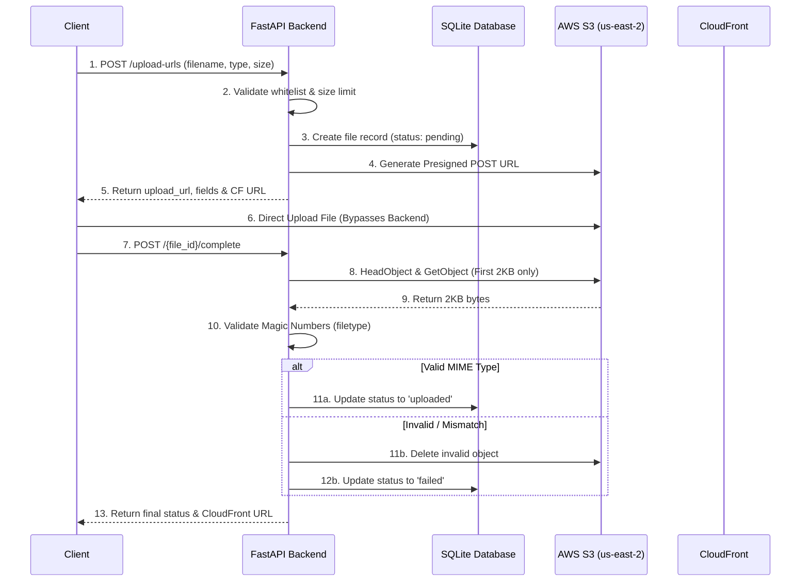

# Image Hosting Microservice

具備安全上傳與快取機制之圖片／檔案管理微型服務。

本服務使用 Python + FastAPI 建立，負責簽發 S3 Presigned Upload URL、管理檔案 Metadata，並透過 CloudFront 提供檔案下載。後端**不承接完整檔案上傳或下載流量**，僅處理簽章、狀態管理與必要的安全檢查（如 Magic Number 驗證）。

---

## 🌟 核心亮點

1. **後端零檔案流 (Zero Byte Transfer)**  
   客戶端直傳 S3，後端不接收、不轉發檔案二進制流，大幅降低 CPU、Memory 與網路頻寬消耗，使服務極易水平擴展。
2. **Magic Number 深度驗證**  
   不輕信客戶端宣告的 `Content-Type`。上傳完成後，後端僅從 S3 讀取檔案**前 2KB**，使用 `filetype` 套件比對 Magic Numbers，確保檔案真實類型，防止惡意副檔名偽造。
3. **全球加速與成本控制**  
   下載完全交由 CloudFront 邊緣節點處理，降低 S3 直接請求費用與延遲，並透過 OAC (Origin Access Control) 確保 S3 來源不被公開存取。
4. **職責分離的微服務設計**  
   將「檔案授權與存取」從主業務邏輯中剝離，主系統只需調用 API 取得 URL，保持核心業務輕量化。

---

## 🏗️ 架構設計

### 上傳與驗證流程



### 下載流程

```text
Client --> CloudFront (Edge Cache) --> S3 (Origin via OAC)
```

後端完全不經手下載流量。

---

## 🛠️ 技術棧

- **Language**: Python 3.12
- **Web Framework**: FastAPI
- **ORM**: SQLAlchemy 2.x
- **Validation**: Pydantic v2
- **Cloud SDK**: boto3 (AWS)
- **Security**: `filetype` (Magic Number validation)
- **Database**: SQLite
- **Cloud Services**: AWS S3, AWS CloudFront

---

## 🚀 快速開始 (本地開發)

### 1. 建立虛擬環境並安裝依賴

```bash
python -m venv .venv
source .venv/bin/activate  # Windows: .venv\Scripts\activate

pip install -r requirements.txt
pip install -r requirements-dev.txt
```

### 2. 設定環境變數

```bash
cp .env.example .env
```

本地開發預設開啟：

```env
USE_MOCK_AWS=true
```

不需要真實 AWS 憑證即可跑通完整 API 流程。

### 3. 啟動服務

```bash
uvicorn app.main:app --reload
```

服務啟動後，可訪問 Swagger UI 進行互動測試：

```text
http://127.0.0.1:8000/docs
```

### 4. SQLite 資料庫

本專案使用 SQLite，資料庫檔案為：

```text
image_hosting.db
```

第一次啟動服務時會自動建立。

如果要重置所有測試資料，可以直接刪除：

```bash
rm image_hosting.db
```

Windows PowerShell：

```powershell
Remove-Item image_hosting.db
```

---

## 📡 API 文件

### 1. 建立上傳簽章

```text
POST /api/v1/files/upload-urls
```

客戶端在上傳前，先向後端請求上傳資格。後端會驗證白名單與大小限制，並回傳 S3 簽章。

Request Body:

```json
{
  "filename": "demo.png",
  "content_type": "image/png",
  "size_bytes": 102400
}
```

Response:

```json
{
  "file_id": "uuid-string",
  "original_filename": "demo.png",
  "s3_key": "files/2026/06/17/uuid.png",
  "upload_url": "https://s3-bucket.s3.amazonaws.com/",
  "upload_fields": {
    "key": "...",
    "Content-Type": "...",
    "policy": "..."
  },
  "expires_in": 300,
  "cloudfront_url": "https://dxxxx.cloudfront.net/files/2026/06/17/uuid.png",
  "status": "pending"
}
```

---

### 2. 確認上傳完成

```text
POST /api/v1/files/{file_id}/complete
```

客戶端直傳 S3 成功後呼叫。

後端會：

1. 確認檔案紀錄存在。
2. 確認 S3 物件存在。
3. 讀取 S3 物件前 2048 bytes。
4. 使用 `filetype` 驗證真實 MIME Type。
5. 若驗證成功，將狀態改為 `uploaded`。
6. 若驗證失敗，將狀態改為 `failed`，並刪除 S3 物件。

---

### 3. 查詢檔案資訊

```text
GET /api/v1/files/{file_id}
```

取得檔案 Metadata 及可用的 CloudFront 下載網址。

---

### 4. 健康檢查

```text
GET /healthz
```

確認服務存活狀態。

---

## 🛡️ 安全與效能設計

| 防護層級 | 實作方式 |
| :--- | :--- |
| **API 層** | 嚴格校验 `content_type` 白名單與 `size_bytes` 上限，攔截無效請求。 |
| **S3 簽章層** | 使用 Presigned POST Policy，限制上傳的 `Content-Type`、檔案大小範圍及 5 分鐘有效期限。 |
| **檔案內容層** | 拒絕信任副檔名與 Header。使用 `filetype` 讀取前 2048 bytes 的 Magic Numbers 進行二次驗證。 |
| **儲存層** | S3 Bucket 開啟 Block Public Access，僅允許 CloudFront OAC 讀取，防止來源站被直接攻擊或盜鏈。 |
| **效能層** | 後端 Zero Byte Transfer，不消耗 EC2/Container 記憶體與頻寬；下載流量由 CloudFront 邊緣節點吸收。 |

---

## 🧪 測試指南

### 單元測試 (Magic Number 驗證)

執行 `pytest` 測試 `filetype` 驗證邏輯是否能正確攔截偽造副檔名：

```bash
pytest -q
```

---

### 真實 AWS 整合測試

若需測試真實 S3 上傳，請將 `.env` 中的：

```env
USE_MOCK_AWS=false
```

並設定真實的 AWS 憑證、Bucket 名稱與 CloudFront Domain。

1. 產生測試檔案（包含合法 PNG 與偽造 PNG）：

```bash
python scripts/create_test_files.py
```

2. 測試合法圖片上傳：

```bash
python scripts/test_real_upload.py valid.png --content-type image/png
```

3. 測試偽造圖片上傳：

```bash
python scripts/test_real_upload.py fake_image.png --content-type image/png
```

偽造圖片預期會在上傳後被後端驗證攔截，並刪除 S3 物件。

---

## ⚙️ 環境變數說明

| 變數名稱 | 說明 | 預設值 |
| :--- | :--- | :--- |
| `APP_ENV` | 執行環境 (local, dev) | `local` |
| `DATABASE_URL` | SQLite 資料庫連線字串 | `sqlite:///./image_hosting.db` |
| `AWS_REGION` | AWS 區域 | `us-east-2` |
| `S3_BUCKET` | S3 Bucket 名稱 | `local-image-hosting-bucket` |
| `CLOUDFRONT_DOMAIN` | CloudFront 分配的 Domain Name | `mock-cloudfront.local` |
| `PRESIGNED_URL_EXPIRES_SECONDS` | 上傳簽章有效期限 (秒) | `300` |
| `MAX_FILE_SIZE_MB` | 單一檔案大小上限 (MB) | `10` |
| `ALLOWED_CONTENT_TYPES` | 允許的 MIME Type (逗號分隔) | `image/jpeg,image/png,image/webp,image/gif` |
| `USE_MOCK_AWS` | 是否使用 Mock AWS (本地開發用) | `true` |
| `VALIDATE_MAGIC_BYTES` | 是否啟用 Magic Number 驗證 | `true` |
| `MAGIC_BYTES_LIMIT` | 驗證時讀取的 Bytes 數量 | `2048` |

---

## 🔮 未來擴充方向 (Roadmap)

- [ ] **檔案刪除 API**：支援軟刪除與 S3 物件同步刪除。
- [ ] **分頁查詢 API**：支援大量檔案 Metadata 的分頁與條件篩選。
- [ ] **過期簽章清理**：排程任務自動將超過 5 分鐘仍為 `pending` 的紀錄標記為 `expired`。
- [ ] **CloudFront Signed URLs**：針對非公開的私有檔案，改由後端簽發短期下載網址。
- [ ] **S3 Event + Lambda**：上傳完成後觸發 Lambda 進行完整的病毒掃描。
- [ ] **圖片轉碼**：透過 Lambda 或 ECS 自動生成縮圖與 WebP 格式。
- [ ] **IaC 部署**：使用 Terraform 或 AWS CDK 管理 S3、CloudFront、IAM 與 ECS 資源。

---

## License
Copyright © 2026 hanwu910514.

詳情請參閱[Apache License 2.0](LICENSE)檔案